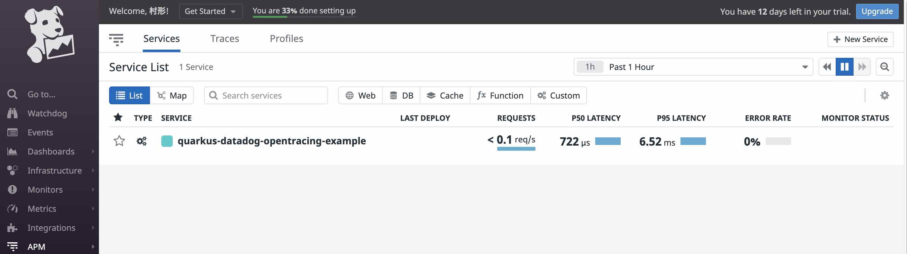
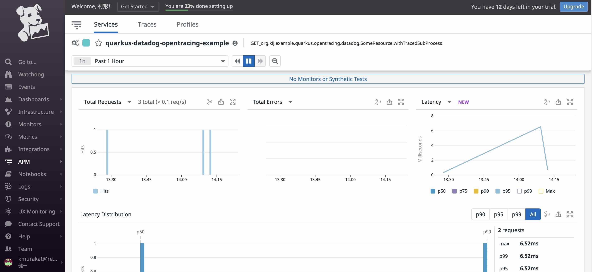
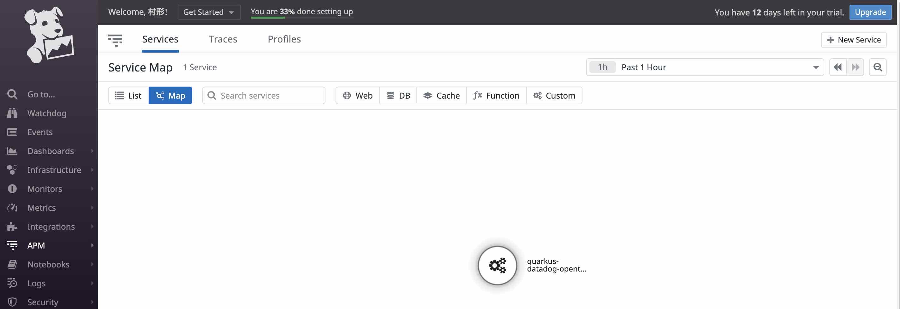
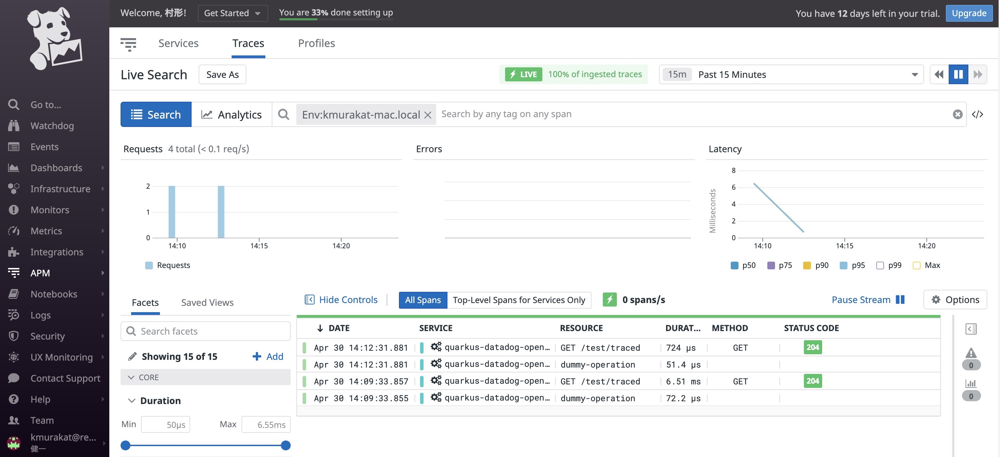
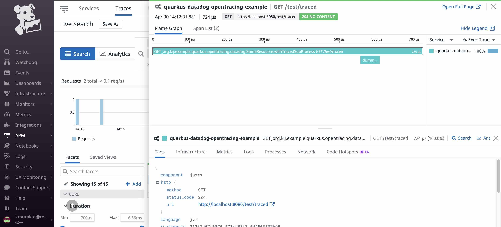

# quarkus-datadog-opentracing-demo
Quarkus Application Send Datadog APM, Logs

## Prerequirement

- Graam VM 11 Java.
- dd-agent on docker container.
- quarkus-datadog-opentracing.

## Notice

quarkus-datadog-opentracing is actively updated at this time.
Therefore, it is expected that changes will be made.

quarkus-datadog-opentracing does not register maven central.
after build, install local maven repository.

## execute

### Build and Install quarkus-datadog-opentracing

```bash
$ git clone https://github.com/quarkiverse/quarkus-datadog-opentracing.git
$ cd quarkus-datadog-opentracing
$ mvn clean package -Pnative
$ mvn install
```

### Execute example application

clone.

```bash
$ git clone https://github.com/nicolas-vivot/quarkiverse-datadog-opentracing-setup-example.git
$ cd quarkiverse-datadog-opentracing-setup-example
```

modify quarkus-datadog-opentracing version into pom.xml

```bash
...
<quarkus-datadog-opentracing.version>1.0.1-SNAPSHOT</quarkus-datadog-opentracing.version>
...
```

Build application.

```bash
$ mvn package -Pnative
$ docker build -f src/main/docker/Dockerfile.native -t quarkus-datadog-opentracing-example .
```

create docker network.

```bash
$ docker network create web
docker network ls
NETWORK ID          NAME                                                   DRIVER              SCOPE
...
b60d5a9be68d        web       
```

### Running a local Datadog Agent

```bash
docker run -d --name dd-agent \
  --network web \
  -v /var/run/docker.sock:/var/run/docker.sock:ro \
  -v /proc/:/host/proc/:ro \
  -v /sys/fs/cgroup/:/host/sys/fs/cgroup:ro \
  -p 8126:8126/tcp \
  -p 8125:8125/udp \
  -e DD_API_KEY=<YOUR_API_KEY> \ # Replace with your Datadog API Key
  -e DD_LOGS_ENABLED=true  \
  -e DD_LOGS_CONFIG_CONTAINER_COLLECT_ALL=true  \
  -e DD_DOGSTATSD_NON_LOCAL_TRAFFIC=true \
  -e DD_APM_ENABLED=true \
  -e DD_HOSTNAME=kmurakat-mac.local \ # Replace the value by your machine name
  -e DD_ENV=kmurakat-mac.local \ # Replace the value by your environment name
  -e NON_LOCAL_TRAFFIC=false \
  gcr.io/datadoghq/agent:latest

docker ps -a
CONTAINER ID        IMAGE                           COMMAND             CREATED             STATUS                    PORTS                                            NAMES
8545f6d5534f        gcr.io/datadoghq/agent:latest   "/init"             45 minutes ago      Up 45 minutes (healthy)   0.0.0.0:8125->8125/udp, 0.0.0.0:8126->8126/tcp   dd-agent
```

### Running Quarkus Application

Start Quarkus binary file.

```bash
$ cd quarkiverse-datadog-opentracing-setup-example
$ ./target/quarkus-opentracing-datadog-1.0.0-SNAPSHOT-runner 
{"timestamp":"2021-04-30T14:08:14.178+09:00","sequence":244,"loggerClassName":"org.jboss.logging.Logger","loggerName":"io.quarkus","level":"INFO","message":"quarkus-datadog-opentracing-example 1.0.0-SNAPSHOT native (powered by Quarkus 1.13.2.Final) started in 0.159s. Listening on: http://0.0.0.0:8080","threadName":"main","threadId":1,"hostName":"kmurakat-mac","processName":"NativeImageGeneratorRunner$JDK9Plus","processId":68050,"service":"quarkus-datadog-opentracing-example"}
{"timestamp":"2021-04-30T14:08:14.18+09:00","sequence":245,"loggerClassName":"org.jboss.logging.Logger","loggerName":"io.quarkus","level":"INFO","message":"Profile prod activated. ","threadName":"main","threadId":1,"hostName":"kmurakat-mac","processName":"NativeImageGeneratorRunner$JDK9Plus","processId":68050,"service":"quarkus-datadog-opentracing-example"}
{"timestamp":"2021-04-30T14:08:14.18+09:00","sequence":246,"loggerClassName":"org.jboss.logging.Logger","loggerName":"io.quarkus","level":"INFO","message":"Installed features: [cdi, config-yaml, datadog-opentracing, jaeger, logging-json, resteasy, smallrye-openapi, smallrye-opentracing]","threadName":"main","threadId":1,"hostName":"kmurakat-mac","processName":"NativeImageGeneratorRunner$JDK9Plus","processId":68050,"service":"quarkus-datadog-opentracing-example"}
{"timestamp":"2021-04-30T14:08:14.645+09:00","sequence":247,"loggerClassName":"org.slf4j.impl.Slf4jLogger","loggerName":"datadog.trace.core.StatusLogger","level":"INFO","message":"DATADOG TRACER CONFIGURATION {\"version\":\"0.78.3~c3312399e\",\"os_name\":\"Mac OS X\",\"os_version\":\"10.15.1\",\"architecture\":\"amd64\",\"lang\":\"jvm\",\"lang_version\":\"11.0.11\",\"jvm_vendor\":\"Oracle Corporation\",\"jvm_version\":\"GraalVM 21.1.0 Java 11 CE\",\"java_class_version\":\"55.0\",\"http_nonProxyHosts\":\"null\",\"http_proxyHost\":\"null\",\"enabled\":true,\"service\":\"quarkus-datadog-opentracing-example\",\"agent_url\":\"http://localhost:8126\",\"agent_error\":false,\"debug\":false,\"analytics_enabled\":false,\"sampling_rules\":[{},{}],\"priority_sampling_enabled\":true,\"logs_correlation_enabled\":true,\"profiling_enabled\":false,\"dd_version\":\"0.78.3~c3312399e\",\"health_checks_enabled\":true,\"configuration_file\":\"no config file present\",\"runtime_id\":\"21237c67-6876-4784-88f7-6d4863592b95\",\"logging_settings\":{}}","threadName":"dd-task-scheduler","threadId":8,"hostName":"kmurakat-mac","processName":"NativeImageGeneratorRunner$JDK9Plus","processId":68050,"service":"quarkus-datadog-opentracing-example"}
```

### Testing

Execute Browser or curl command.

```bash
http://localhost:8080/test/traced

or

http://localhost:8080/quarkus-datadog-opentracing-example/test/traced
```

### Confirm Datadog

### Services

APM -> Services

service appears.



more details.



### Service Map

APM -> Service Map

service appears.



### Traces

APM -> Traces

HTTP requests for the specified time period are displayed.



After selecting one HTTP request, Appear root span and child span information.



## ToDo

I have tried it a few times, I failed to run quarkus-datadog-opentracing-example application using docker.

Therefore I executed binary file directly.

## Reference

https://github.com/quarkiverse/quarkus-datadog-opentracing

https://github.com/nicolas-vivot/quarkiverse-datadog-opentracing-setup-example

https://github.com/n-essio/public_datadog_poc